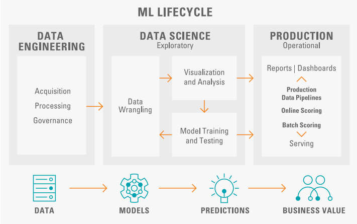
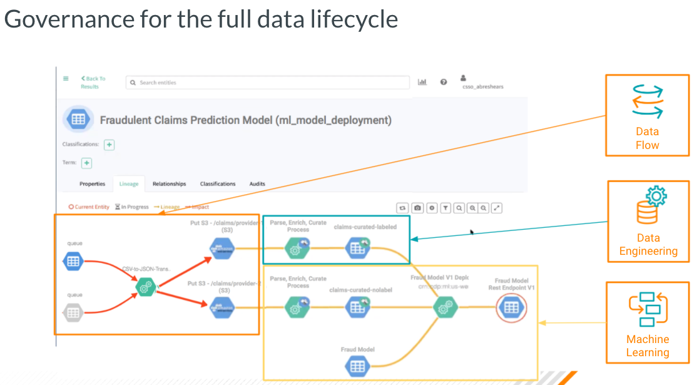
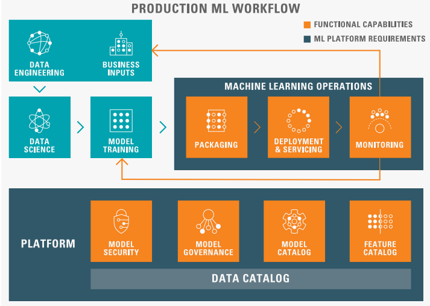
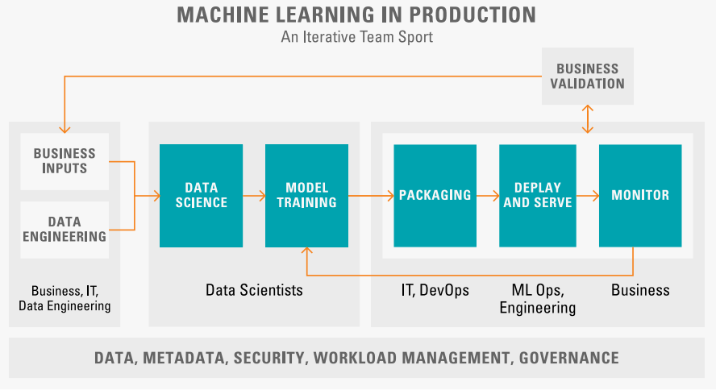
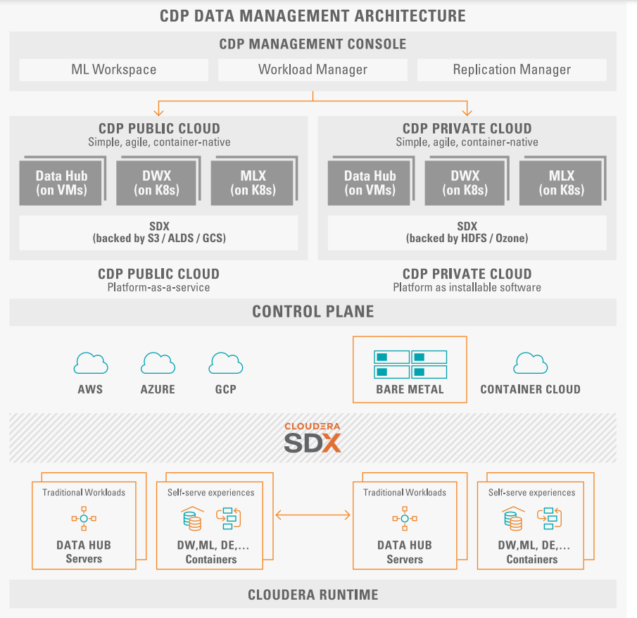
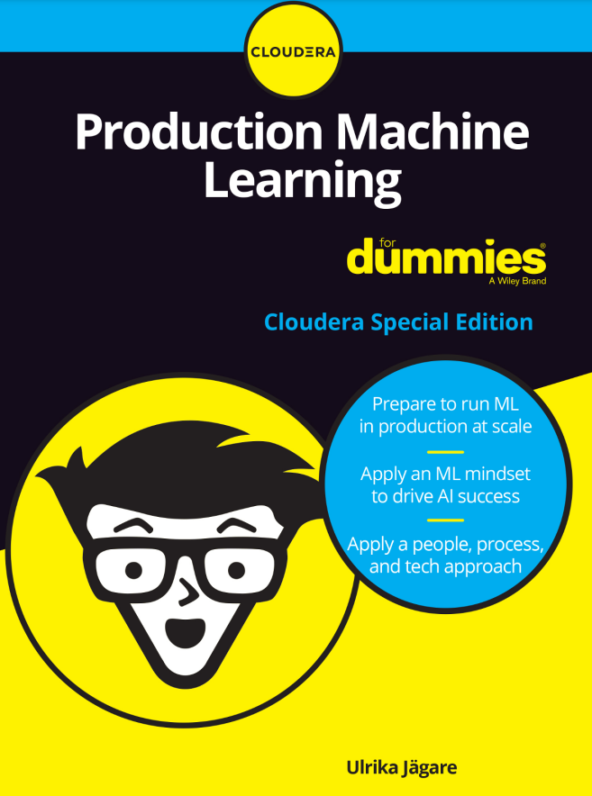
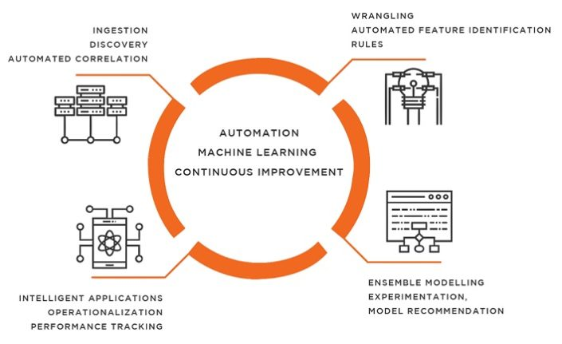
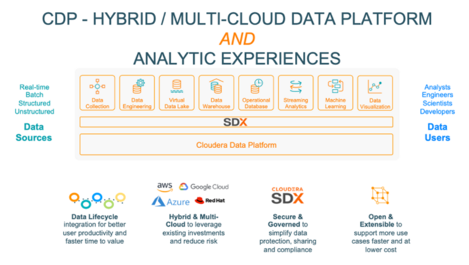

# An MLOps Workflow using Cloudera Machine Learning and Cloudera Data Engineering

## Summary

This is a demo of ML Ops in the Cloudera Data Platform using the Machine Learning and Data Engineering Data Services.

This document is divided in two parts. 

1. An introduction to ML Ops and the Cloudera Data Platform  
2. Guided instructions for deploying the demo scripts and completing the steps to build an end to end ML Ops pipeline

# 1. Introduction to ML Ops and the Cloudera Data Platform

Machine learning (ML) plays a critical role in optimizing the
value of digital transformation. Across industries, organizations seek to leverage the digital revolution for more
revenue or lower costs.

However, it’s not as easy as it may seem to effectively deploy
machine learning in the enterprise.

The overall objective should
be to quickly and seamlessly be able to move ML models and
operate increasing numbers of models on a continuous basis. This
is hard, and in this book you find out about the right production
machine learning approaches, best practices, and MLOps technology that is critical for creating, sustaining, and scaling your
business impact using ML.

To succeed with your ML investment, you need to rapidly implement and scale ML models across your entire organization. Usually these implementation scenarios span a large spectrum of ML
use cases. The need for organizational speed in combination with
growing regulatory scrutiny related to data and AI/ML, create new
and unique challenges to move ML models from idea and experimentation, to production.

Currently only 35 percent of organizations indicate that
their ML models are fully and successfully deployed in production. And on top of that, the journey doesn’t end when models are
deployed. On the contrary, it’s vital to ensure that models continue to operate and perform as expected, or even better and more
optimized, throughout their entire lifecycle.

A typical data science workflow goes through different phases but
is complex and highly iterative. At the bottom of Figure 1-1 you
can see the various steps of a data science workflow from data to
models to outcomes to business value. The figure itself is mapped
into three main phases: data engineering, data science, and production. This figure also has slightly more emphasis on the production
phase and the governance aspects than a typical ML workflow.

However, for enterprises, even before the data engineering workflow is started, it’s vital to secure that you have a robust data
management and IT practice in place to ensure enterprise governance, security, access control, and data lineage. This is a key
part of the ML lifecycle because it eliminates things like silos and
creates an observable, explainable, and transparent foundation
for the execution of the ML workflow.

## Data engineering

This phase consists of tasks such as data acquisition, processing,
and governance. In this context data processing refers to transforming raw data by cleansing and preparing datasets to a more
convenient format for a developer or a data engineer to run an
analysis on.
As organizations use data (and analytics) more, and for more
important questions and user scenarios, the need be able to rely on
the data, and therefore the need to govern those assets, increases.
Every organization should be concerned about data quality in
their source systems, but often these concerns are isolated and
not visible across departments. Security, privacy, and regulatory
compliance are also important elements of data governance.

## Data science

Data science is an interdisciplinary field that uses scientific methods, processes, algorithms, and systems to extract knowledge and
insights from structured and unstructured data. Data science is
also a concept to unify statistics, data analysis, machine learning, and other related methods to understand and analyze actual
phenomena with data spanning from more traditional business
intelligence (BI), through analytics, and more exploratory ML
techniques.

More traditional analytics and BI includes areas such as data
preparation, data visualization, and data modeling. Data preparation refers to the process of transforming and mapping data from
its raw data form into another format with the intent of making it
more appropriate and valuable for a variety of analytics use cases.
Data visualization (or data exploration as it´s also called) on the
other hand helps identify interesting patterns and trends in the
data that can be identified and analyzed through simple charts 

such as line charts or bar charts. Data modeling is the process of
producing a descriptive diagram of relationships between various
types of information that are stored in a database.
Exploratory data science and ML includes probabilistic modeling
and ML model development (model training and testing), where
probabilistic modeling helps understand the probability of what
could happen based on a variety of inputs and data.
ML model development can also be focused on automating processes or making ongoing predictions that learn/change based
on new data. ML model development can be targeting a certain product, such as learning what a person regularly watches
on Netflix and suggesting programming they will likely enjoy.
Another objective can be a business segment, for example security
and fraud prevention, where the ML model shall detect anomalies or patterns in incoming data to enable proactive detection of
breaches.

## Production

This part of the ML lifecycle is focused on the process of delivering the outcomes (better automation, predictions, innovations)
to stakeholders (customers, internal business). There are several different ways to deploy a model and it´s key to understand
the end user (customer) objective to determine the technology
required.
What the deployment phase actually means can differ a lot depending on what type of use case you’re trying to realize. It could be
as simple as generating a report, or as complex as implementing a repeatable data science process critical for business operations. Regardless of use case, however, successful production ML
requires a streamlined, frictionless and predictable deployment,
and ongoing governance of ML models in production, at scale.

## Identifying Challenges with Getting ML to Production

Deploying and scaling AI/ML across the enterprise requires
implementing complex, iterative workflows end-to-end from
capturing data through developing ML models to achieving the
expected outcomes. This is not an easy task. In addition, as the
number of AI/ML projects and models multiply, production ML
can be slow, cumbersome, and fraught with “false starts” that
make it even more difficult and expensive.
While the end-to-end ML lifecycle has always been pitched as an
actual “cycle,” to date there has been limited success in actually
managing this end-to-end process at enterprise level scale. Some
reasons for this are:

* Data scientists are usually not trained engineers and thus
don’t always follow good DevOps practices.
* Data engineers, data scientists, and the engineers responsible for delivery operate in silos that creates friction between
teams.
* The myriad of machine learning tools and frameworks
fosters a lack of standardization across the industry.

Machine learning realization from an enterprise perspective is
slow and tough to scale. There is not much automated, collaboration is difficult, and the actual operationalized models delivering
business value are few.
Many projects don’t make it into production because of model
inefficiencies that slow down or halt the entire process. Or, in
many cases, organizations fail to adequately adopt production
models because of a lack of internal knowledge on how they work
and other cultural/business impediments.
As organizations start to see artificial intelligence (AI) and
machine learning (ML) as fundamental and vital pieces of the
company, organizations are usually wrestling with growing organizational pain. Isolated projects exist in silos across the enterprise, putting quality, security, governance, and compliance at
risk. When applying an “AI factory” approach to turning data
into decisions, you can make the process of building, scaling, and
deploying enterprise ML solutions automated, repeatable, and
predictable, but lose the business value along the way.
Only through the industrialization of AI can you shift focus from
technology solutions to business outcomes, empower continuous optimization, and encourage a learning culture across the
enterprise.

Truly excellent industrial-grade ML requires transformation in
almost every part of an organization, and as a result, production
ML hurdles are often actually organization wide hurdles. Some of
these hurdles are described in the following sections.

## Unsatisfactory model monitoring

Efficient monitoring of models in operation is an essential element of production deployment as it provides visibility into its
various phases. Poor visibility into mathematical metrics and to
the external tools used for monitoring is a major challenge. Custom tooling to monitor the technical health of models doesn’t
scale and mathematical monitoring is hard, customized, and little
to no tooling exists.
On the other hand, standard monitoring tools tend to be too
generic for identifying model drift, such as identifying whether
the ML model execution is deviating from its objective. The truth
is that what really happened based on the prediction is usually
only understood well after the fact. This means that determining
whether a model is functioning as it should needs to be customized on a per model basis.

## Inefficient deployment

Data scientists today use a variety of different tools to solve many
critical business problems. This often results in models being
recoded into different languages as the initial language may not
be used in the production environment. This leads to longer cycle
times and potential inconsistencies in the translated model.

## Inadequate ML governance

As AI/ML moves to production, the need to govern all IT assets
(data, models, infrastructure, for example) and ensure security,
privacy, and regulatory compliance increases. Defining standards
for ML Operations (MLOps) is essential for deploying and governing ML models at scale for enterprises. This includes visibility of
models within teams and across organizations. It enables teams
to understand how ML is being applied in their organizations and
requires an official catalog of models.

In the absence of such a model catalog, many organizations
are unaware of their models and features, such as where they
are deployed and what they are doing. This leads to substantial
rework, model inconsistency, recomputing features, and other
inefficiencies.

## Insufficient security measures

There is a need for end-to-end enterprise security from data to
the production environment. The chosen platform must be capable of delivering models into production with inherited security,
unified authorization, and access tracking.

## Inability to scale

As the model moves forward to production, it’s typically exposed
to larger volumes of data. The platform must have the ability to
scale from small to large volumes of data and automate model
creation. Applied machine learning at enterprise scale requires a
particular combination of cutting-edge technology and enterprise
expectations.
Additionally, it’s not only about scale of data, but the number
of actual models in production. Operating and monitoring a few
models may be fine, but when you scale up to hundreds of models it’s very difficult to make sure they are not drifting and are
maintaining their reliability. This is a common concern for customers in the banking sector, where they have entire teams of ML
engineers dedicated to just keeping their models accurate in the
long term.

A major concern is also when brand new (and at times) untested
or poorly supported technology, tools, and systems are rapidly
deployed into enterprise application workflows aimed for the ML
lifecycle and are expected to perform at least as well as existing
software that has been in place (at times) for years.

# Detailing Key Capabilities of Production ML

Production ML capabilities include:
» Packaging, deployment, and serving are the three first
steps in production ML. Right packaging is necessary for
automated deployment of production models and to
address multiple deployment patterns. Enterprise level
deployments need high availability, autoscaling, and strong
authentication features. Serving makes a trained model
available to other software components. Models can be
served in batch or real-time modes.
» Monitoring is an important element of operationalizing
ML. After a model is deployed into production and providing
utility to the business, it’s necessary to monitor how well
the model is performing. There are several aspects of
performance to consider, and each has its own metrics and
measurements that impacts the lifecycle of the model.
However, monitoring is done at various stages of the lifecycle,
for example to check input and output distribution, look for
skew, model drift and accuracy change, add custom
thresholds, send emails with results, and trigger alarms.
» Model governance, cataloging, and lineage tracking are a
basic requirement for model governance and enable teams
to understand how ML is being applied in their organizations.
Governance requires a centralized catalog of models and
features that facilitate tracking models and their features
throughout their lifecycle to understand these features and
their relationship with the data catalog. Catalogs also facilitate
authorization and tracking access to models thereby maintaining end-to-end security of the environment.
Data lineage regards the need to have visibility into the full
ML lifecycle, starting with where the data originates and
ending with the ongoing production environment. This
includes every process along the way, from data ingest to
data engineering, to model building, deployment, serving,
and production, and even security and governance
visibility — who touched what when, what data powered
what models, and who had access to this data at every step.

So, what does good MLOps look like? How can you ensure that
you’re getting your production ML right from start? Well, good
MLOps looks a lot similar to good DevOps.
» Reduce the time and difficulty to push models into
production.
» Decrease friction between teams and enhance collaboration.
» Improve model tracking, versioning, monitoring, and
management.
» Create a truly cyclical lifecycle for the modern ML model.
» Standardize the machine learning process to prepare for
increasing regulation and policy.

As opposed to ML point solutions, a unified data platform doesn’t compromise security or require complex, costly workflows for
production models. Instead you get an end-to-end ML platform
that enables standards-driven model and feature monitoring,
cataloging, and ongoing governance at enterprise scale.

## Describing the Cloudera Data Platform

Cloudera Data Platform (CDP) is an enterprise data cloud, which
functions as a platform for both IT and the business. It incorporates support for an environment running both on on-premises
and in a public cloud setup. CDP also has multi-cloud and multifunction capabilities at the same time as it’s both simple to use
and secure by design. It supports both manual and automated
functions and is open and extensible. It offers a common environment for both data engineers and data scientists, supporting
data science team collaboration. Figure  4-2 shows a capability
overview of CDP.
The data platform from Cloudera provides self-service access to
integrated, multi-function analytics on centrally managed and
secured business data while deploying a consistent experience
anywhere  — on-premises or in hybrid and multi-cloud. This
includes consistent data security, governance, lineage, and control, while deploying the efficient, easy-to-use cloud analytics,
eliminating end-user need for shadow IT solutions.

To optimize the data lifecycle CDP has multi-function analytics
capabilities that integrate data management and analytic experiences across the data lifecycle. You can collect, enrich, report,
serve, and model enterprise data for any business use case in any
cloud.
Because high value, data-driven business use cases require modern, streaming real-time data, CDP has integrated analytics and
machine learning services that are both easy for IT to manage and
deploy and easy for business users to consume and operationalize.
CDP makes it easy to deploy modern, self-service analytics and
machine learning services for any data, with shared security and
governance and the flexibility to scale with the same experience.
CDP also delivers security, compliance, migration, and metadata
management across all environments.
CDP is an open platform where you can add and build your solutions using open source components including open integrations.
It’s also open to multiple data stores and compute architectures.
This in turn
enables the following capabilities:

* A holistic view of data and metadata.
* A common data catalog across all your deployments
worldwide in various data centers and clouds.
* Synchronization of data sets and metadata policies between
infrastructures as needed.
* Bursting on-premises workloads into the cloud when more
capacity is needed.
* Analyzing and optimizing workloads regardless of where the
workloads run.

On top of the data platform you can run Cloudera Machine Learning
(CML); refer to Figure 4-1. CML has extensive MLOps features and
a set of model and lifecycle management capabilities to enable 
the repeatable, transparent, and governed approaches necessary
for scaling model deployments and ML use cases. It´s built to support open source standards and is fully integrated with Cloudera
Data Platform, enabling customers to integrate into existing and
future tooling while not being locked into a single vendor.
Cloudera Machine Learning (CML) enables enterprises to proactively monitor technical metrics such as service level agreements
(SLA) adherence, uptime, and resource use as well as prediction
metrics including model distribution, drift, and skew from a single governance interface. Users can set custom alerts and eliminate the model “black box” effect with native tools for visualizing
model lineage, performance, and trends.
Some of the benefits with CML include:

* Model cataloging and lineage capabilities to allow visibility
into the entire ML lifecycle, which eliminates silos and blind
spots for full lifecycle transparency, explainability, and
accountability.
* Full end-to-end machine learning lifecycle management that
includes everything required to securely deploy machine
learning models to production, ensure accuracy, and scale
use cases.
* An extensive model monitoring service designed to track and
monitor both technical aspects and accuracy of predictions
in a repeatable, secure, and scalable way.
* New MLOps features for monitoring the functional and
business performance of machine learning models such as
detecting model performance and drift over time with native
storage and access to custom and arbitrary model metrics;
measuring and tracking individual prediction accuracy,
ensuring models are compliant and performing optimally.
* The ability to track, manage, and understand large numbers
of ML models deployed across the enterprise with model
cataloging, full lifecycle lineage, and custom metadata in
Apache Atlas.
* The ability to view the lineage of data tied to the models built
and deployed in a single system to help manage and govern
the ML lifecycle.
* Increased model security for Model REST endpoints, which
allows models to be served in a CML production environment without compromising security.

Furthermore, all enterprise production ML workflows are
securely contained in CDP, Cloudera’s enterprise data cloud. This
enables seamless workflows for governing and quickly customizing models in production while maintaining complete visibility
into the end-to-end data and model lineage. Clients can effectively maintain hundreds or thousands of models in production
with resources that auto-scale to business needs and set model
governance rules that enable fast response to mission critical
changes in their production environments.
Governing production ML workflows in CML enables enterprises
to accelerate time to value and deliver ongoing results securely.
CML is able to integrate data management with explainable,
interoperable, and reproducible MLOps workflows in various execution environments, from edge to cloud.

To learn more about Enterprise Machine Learning, MLOps and the Cloudera Data Platform please [download the full book](https://www.cloudera.com/campaign/production-machine-learning-for-dummies.html) authored by Santiago Giraldo Anduaga, Product Marketing Director at Cloudera. 

# 2. Instructions for Hands On Demo Execution

### Summary

The Hands On Steps are divided in three sections.

#### 1. Modeling in the Cloudera Machine Learning Data Service
* You will perform some basic data exploration with Spark 3.1 and store the data in an Iceberg table. 
* Next, you will create a ML model baseline for a binary classification task with the Spark ML library in CML Sessions. 
* Finally, you will deploy the model to a secure REST endpoint and perform inference on it with the CML Jobs and Models features via the CML API (V2).

#### 2. ETL Pipelines in the Cloudera Data Engineering Data Service
* You will deploy an Airflow DAG in a CDE Virtual Cluster
* This DAG will use a combination of Cloudera Airflow Operators to perform Spark ETL into a staging table, trigger the same CML Job pipeline you created in part 1 via HTTP, and build a report in the Data Warehouse Data Service

#### 3. Pipeline Reproducibility
* You will rerun the same Airflow DAG but this time the Spark ETL job will load data that will cause the CML pipeline to fail
* Next, you will retrieve the original data the Spark ML model was trained on, modify the Spark Pipeline to solve the problem, and rerun the Airflow DAG

#### 4. Future: 
* Load the staging table from the Operational Database Data Service
* Using the DW report, create a simple dashboard in Cloudera DataViz 

## Step by Step Instructions (WIP)

All notebooks include further instructions, screenshots and detailed explanations about the code 
Code modifications NOT required
You can simply execute all the code by launghing a CML Session with the following parameters

Editor: JupyterLab
Kernel: Python 3.7 or above
Edition: Standard
Enable Spark with version 3.1.1
Resource Profile: 2 vCPU/4GiB Memory - 0 GPUs

Notice that once you have launched the CML Session, JupyterLab will provide a GUI to explore the CML filesystem and open notebooks without launching a new session 

#### 1. Modeling in the Cloudera Machine Learning Data Service

##### 1.1 Create a Model Baseline

Create a CML Session and execute the ModelPrototype.ipynb notebook

##### 1.2 Deploy the Baseline Pipeline to a REST Endpoint via the CML API (V2)

Using bar on the left, open the CICD.ipynb notebook and execute all cells

##### 1.3 Get Acquainted with the Inference Job

As instructed int he CICD.ipynb notebook, return to the CML Project home and observe CML Job execution by opening the Jobs tab

When the Inference Job finally runs, open the Job History tab and then the Monitoring tab to observe inference results in real time

#### 2. Building Pipelines in the Cloudera Data Engineering Data Service

##### 2.1 Create an Airflow Job

The cde_jobs folder in the CML project home contains a series of CDE Jobs. Open it and download all files to your local computer.

Navigate to Create a CDE Virtual Cluster and create a Job for each file contained in the folder. **WIP Add more instructions here**

Finally, create a CDE Job of Type Airflow using the airflow_dag_mlops_success.py. Choose a name of your choice. Execute the Job.

##### 2.2 Airflow Job Execution

While the job is executing, open the Airflow UI and open the Code tab. Familiarize yourself with the DAG and notice the different Cloudera Operators in use.

* The CDEJobOperator executes a simple Spark ETL Job. We use this to load some fresh data into the Iceberg table.
* The CMLJobOperator allows you to trigger CML Job execution. Notice this is configured to run the same CML Jobs we executed above.
* The CDWJobOperator performs a simple query to report on current inference metrics. It allows other stakeholders to have a pulse on the Model's ROI. 

The Airflow DAG is executing. Hover over to the Tree View and Graph Views and monitor execution of the whole pipeline in real time

#### 3. Pipeline Reproducibility in the Cloudera Data Engineering Data Service

##### 3.1 Create a failing Airflow Job and Execute 

Create a new CDE Job with the batch_load_fail.py script, and a new Airflow Job with the airflow_dag_mlops_fail.py job

Execute the new Airflow Job and observe the pipeline fail from the Tree View in the Airflow UI

##### 3.2 Troubleshoot the new Airflow DAG

Open the Graph View and explore the interface. Can you tell what went wrong? 

The data loaded by the Spark ETL job includes some categorical types but this caused the CML Jobs to fail.

Notice that although the CI/CD pipeline (CML Jobs) failed, the old model endpoint is still alive and kicking. The model endpoint is containerized and is thus isolated from any failures in the other stages of the pipeline. 

##### 3.3 Reproduce the Original Dataset used for Model Training

Navigate back to your CML project, explore the Iceberg table via Spark SQL and in particular, roll back the data to the original snapshot.

Open the ModelPrototype.ipynb notebook and inspect the Spark pipeline. Can you tell why the TrainModelJob.py script failed?

It failed because the pipeline transformers don't include a StringIndexer capable of handling categorical data.

Let's fix it... replace the code in the make_pipeline method with the following code

** Insert code here or create new script?? **

Now rerun the entire notebook. Notice you are retraining the same model with the same data you used originally, although your Spark ML Pipeline is slightly changed. 

This is important as the development and tuning work was originally performed on the original dataset. If you retrain the model on the new data you will likely run into new biases, errors, and have to dive back into model tuning. 

And that is not even assuming you don't have to rerun the pipeline through internal validation and compliance processes!

###### When Models fail you rarely have time to redo everything from scratch. By quickly accessing each version of the data you can fix the problem within a limited timeframe and perform more detailed post-mortem analysis. 

##### 3.4 Execute the new Airflow DAG in the Data Engineering Data Service

Navigate back to your CDE Virtual Cluster. Execute the same Airflow DAG and observe as it succeeds this time. 

#### Final Conclusions

Congratulations! You have not only created an end to end ML Ops pipeline but you have remedied a production failure.

In summary:

* Machine Learning pipelines require a ML platform that can provide seamless transition between the Development and Deployment phases of a ML project, as well as robust integrations with Data Engineering services outside of the ML platform's perimeter.
* A unified architecture allows Metadata, Security and Lineage to be interoperable across applications and use cases. This is not possible with platforms designed on individual frameworks because implementing security, lineage and metadata becomes a complex implementation challenge.
* Apache Iceberg provides an unified table format and the ability to reproduce Edge2AI applications to any previous state. This is a key aspect for Production Robust Use Cases as well as Regulatory Compliance, and more.  

##### Thank you for completing this demo! 

